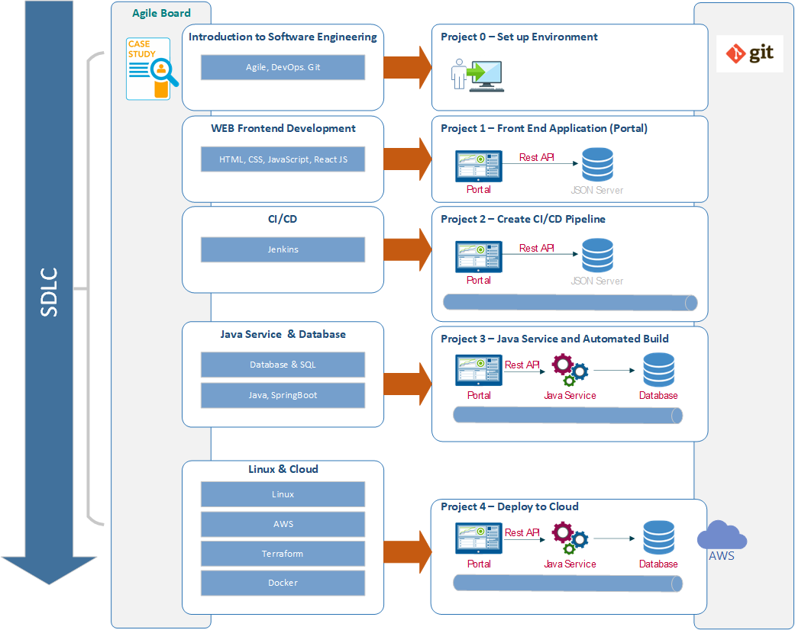

# FASE - Program Project

- [FASE - Program Project](#fase---program-project)
  - [Introduction](#introduction)
  - [The Estate Agent Case Study](#the-estate-agent-case-study)
    - [Feature: Manage Buyer](#feature-manage-buyer)
    - [Feature: Manage Seller](#feature-manage-seller)
    - [Feature: Manage Property](#feature-manage-property)
    - [Feature: Manage Bookings](#feature-manage-bookings)
  - [Minimal Viable Product](#minimal-viable-product)

**Reference Implementations (Model Answers)**

- [Project 1 - WEB Application](project1-react/README.md)
- [Project 2 - Jenkins CI/CD](project2-cicd-pipeline/README.md)
- [Project 3 - SpringBoot MicroService](project3-springboot/README.md)
- [Project 4 - AWS Design and Deploy](project4-aws-design-deploy/README.md)

---

## Introduction
The program is designed to give experience of the Software Development Life Cycle (SDLC) from Development, Build to Deploy.  It uses a case study for an Estate Agent Management application that will be develope over a series of incremental projects that build on top of knowledge gain from each learning module.  Each project is analogous to a Sprint.

<figcaption><b>Fig.1 - Project Plan</b></figcaption>

---

**Project 0**
This is equivalent of the set-up sprint and will be part of the GIT exercises by setting up a GIT repository that will be used by rest of the projects for source and version management.

**Project 1**
Create Application Frontend 

**Project 2**

Design and create pipeline that will build and deploy the whole application

**Project 3**
Create Java Microservice and link to front end

**Project 4**
Design and create AWS infrastructure and deploy application for access from the WEB

---

## The Estate Agent Case Study
The project revolves around an Estate Agent Management System with the following Features:

### Feature: Manage Buyer
>**Scenario: Register Buyer**   
Given the new buyer with the given first name and surname does not exist   
When a create buyer request is received with the given first name and surname   
Then a new buyer record is created with a buyer ID   

### Feature: Manage Seller
>**Scenario: Register Seller**   
Given a seller with the given first name and surname does not exist   
When a create seller request is received with the given first name and surname   
Then a new seller record is created with a seller ID   

### Feature: Manage Property
**NOTE**: A property can have the following status:  FORSALE, SOLD, WITHDRAWN
>**Scenario: Add Property**   
Given a seller exists for the new property   
When a create property request for the given seller is received   
Then the property is added to the catalogue   
Then the property status is set to FORSALE   

>**Scenario: Find properties**   
When a Find properties request is received   
Then a list of properties with the corresponding criteria is shown   

>**Scenario: Withdraw Property that is FORSALE**   
Given The required Property exists   
Given The required Property is FORSALE   
When a Withdrawn property request is received   
Then property status is changed to WITHDRAWN   

>**Scenario: Resubmit Property that has been WITHDRAWN**   
Given The required Property exist   
Given The required Property has been WITHDRAWN   
When a Resubmit property request is received   
Then property status is changed to FORSALE   

>**Scenario: Amend properties details**   
Given The required Property exist   
Given The required Property is FORSALE   
When an Amend property request is received   
Then property details is updated   

### Feature: Manage Bookings
**Note**:  Viewing slot is every hour on the hour between 8am to 5pm every day including weekends and holidays
>**Scenario: Make booking with Slot available**   
Given no active booking exists for the desired time slot for the property   
Given the property status is FORSALE   
Given the buyer is registered   
When a viewing is requested   
Then a booking is created for the buyer for the property at the given time slot   

>**Scenario: Make Booking - Time Slot not available**   
Given a booking already exists for the required timeslot for the given property   
When a viewing is requested is made for that time slot   
Then an error is shown to the user   

>**Scenario: Cancel Booking**   
Given a booking exists   
When a cancel booking request is made   
Then the booking is removed   

---

## Minimal Viable Product

- **Manage Seller**
  - Register a new seller
  - Display all sellers

- **Manage Properties**
  - Add properties
  - Display all properties
  - Find and display properties with given search criteria on price, bedrooms, bathroom and garden
  - Withdraw a property
  - Resubmit a property

- **Manage Buyer**
    - Register new buyer
    - Display all buyers
