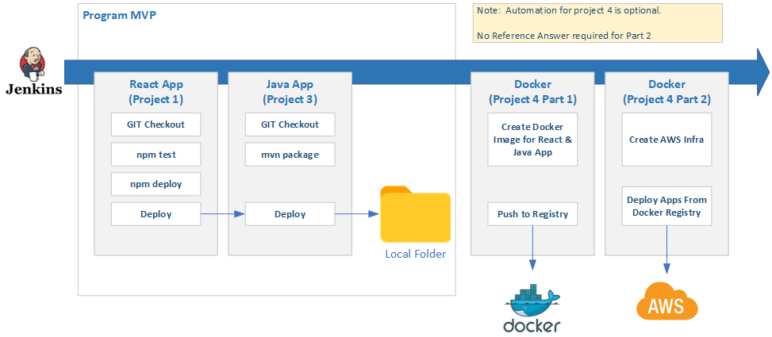

**&larr; [Back to Program README](../README.md)**
# Project 2 CI/CD Design

- [Project 2 CI/CD Design](#project-2-cicd-design)
  - [Introduction](#introduction)
  - [Reference Solution](#reference-solution)
---
## Introduction

Project 2 serves as a foundational step towards creating an automated workflow that subsequent projects can leverage.  Normally, the CI/CD pipeline is created at the beginning of a development project, but this is pushed back to after WEB development modules to allow learners to have a better understanding what they are automating.

The diagram below shows the required pipeline.  At this stage only the React Application will exist so the pipeline will only build the WEB Frontend.  Project 3 will include the build task for Java.



<figcaption><b>Fig.1 - CI/CD</b></figcaption>

## Reference Solution
```javascript   
pipeline {
    agent any
    stages {
        stage ('Build React') {
            steps {
                // This is the URL of the your repository holding you react project
                // If your React and Java Project is in the same repository then you will need to add a step to "cd" into the react project folder
                
                git url: 'https://github.com/your-repo'
                
                bat "npm install"
                bat "npm test"
                bat "npm package"
            }
        }
        // This stage will fail until you have completed Project 3 (Java Springboot)
        stage ('Build Maven') {
            steps {
                // This is the URL of the your repository holding you Java/SpringBoot project
                // If your React and Java Project is in the same repository then you don't need to clone the reporistory again BUT
                // you will need to "cd" into the Java folder
                
                git url: 'https://github.com/your-repo',
                    branch: 'main'

                withMaven {

                // Run the maven build
                bat "mvn clean package" // deploy also runs all phases prior to deploy

                } // Maven will discover the generated Maven artifacts, JUnit Surefire & FailSafe & FindBugs & SpotBugs reports...
            }
        }
    }
    post {
        always {
            mail to: you@example.com,
                 subject: "Jenkins build ${env.BUILD_NUMBER}",
                 body: "Build no. ${env.BUILD_NUMBER} finished with status: ${currentBuild.currentResult}."
        }
    }
}
```
