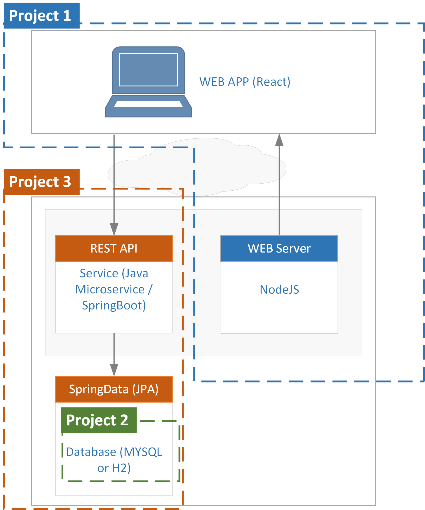

**&larr; [Back to Program README](../README.md)**
# Project 3 - Spring Microservice Reference Design & Implementation 

  - [Introduction](#introduction)
  - [Tasks](#tasks)

* [Development Environment & Setup](docs/development-environment.md)
* [API Design](docs/endpoints.md)
* [Application Archtecture](docs/architecture.md)
---

## Introduction

Project 3 is concerned with Java microservice in which you will need implement the <a href="docs/endpoints.md">REST API</a> as defined for Project 1.

{width=500px}
<figcaption><b>Fig.1 - Project Boundaries </b></figcaption>

---
## Tasks

The following lists the tasks required for Project 1,2,3.

>**Feature: Register Seller**  
**Feature: Manage Properties**  
**Feature: Register Buyer**  
**Feature: Manage Booking**
> 
> - For each feature create the controller, DTO, mapping and entity for each domain : 
>   - Seller <mark>*Minimum Requirement<mark/>
>   - Buyer <mark>*Minimum Requirement<mark/>
>   - Property <mark>*Minimum Requirement<mark/>
>   - Booking *<mark>This is needed if you have implemented Booking in the frontend<mark/>
> - Create e2e tests 
