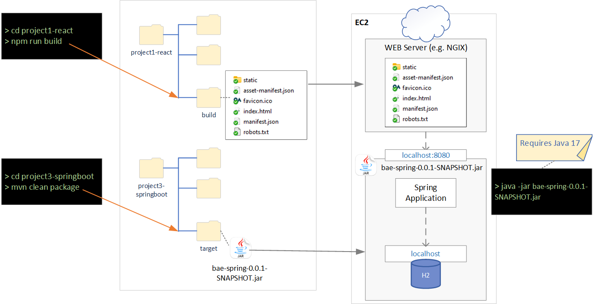

**&larr; [Back to Program README](../README.md)**
# Project 4 AWS Design and Deploy

<!-- TOC -->
- [Project 4 AWS Design and Deploy](#project-4-aws-design-and-deploy)
  - [Introduction](#introduction)
  - [Minimum Reference Design](#minimum-reference-design)
<!-- TOC -->
---
## Introduction
Project 4 is concerned with building the infrastructure on which your application will run. In this project, the infrastructure will be built in AWS. Details will be discussed during the course.

## Minimum Reference Design

The following shows a high level design for a AWS minimum deployment design.  This minimum design has many shortcomings such as it will not scale as the DB is embedded into the Java application.  A better solution for this is to use AWS RDS as the remote DB.

**Note** Remember that if you move the DB, you would need to change connection string in application.properties and rebuild.  Similarly, If you deploy the frontend and backend on different machines/locations, you want need to update any hardcoded "localhost" calls in the React Application (and rebuild).
